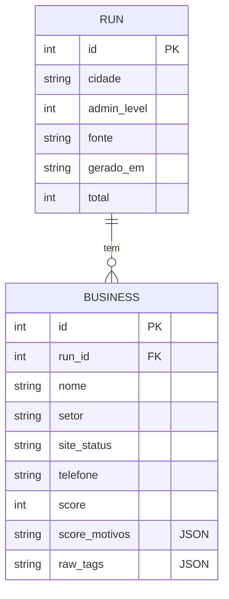

# Design de Banco de Dados

Como os dados do Scout são modelados e persistidos — do esquema atual (SQLite cru) ao alvo
(SQLModel + Alembic), com as decisões de modelagem e o porquê.

## Modelo de dados

Uma execução do Scout (`Run`) tem muitos negócios (`Business`) — relação **1 : N**.



## Esquema atual (SQLite, SQL cru)

Hoje o [`db.py`](https://github.com/hectorautomacoesdev/fabrica-de-sites/blob/main/src/fabrica_sites/db.py)
cria o schema à mão e guarda as tags como JSON:

```sql title="src/fabrica_sites/db.py (trecho)"
CREATE TABLE IF NOT EXISTS businesses (
    id            INTEGER PRIMARY KEY AUTOINCREMENT,
    run_id        INTEGER NOT NULL REFERENCES runs(id) ON DELETE CASCADE,
    nome          TEXT,
    setor         TEXT,
    site_status   TEXT,
    score         INTEGER,
    score_motivos TEXT,   -- JSON
    raw_tags      TEXT    -- JSON
);
CREATE INDEX IF NOT EXISTS idx_business_run ON businesses(run_id);
```

### Decisões de modelagem

- **`raw_tags` e `score_motivos` como JSON.** As tags do OSM são um dicionário aberto e
  variável; normalizá-las em tabelas seria custoso e pouco útil. Guardar o JSON cru permite
  **reprocessar/auditar** sem reconsultar a fonte. É uma escolha pragmática: normalizamos o
  que consultamos/filtramos (setor, status, score) e deixamos como JSON o que é só leitura.
- **`ON DELETE CASCADE`.** Apagar uma `run` apaga seus negócios — sem órfãos.
- **Índice `idx_business_run`.** Quase toda consulta filtra por `run_id`; o índice evita
  varredura completa da tabela. (Regra geral: indexe colunas usadas em `WHERE`/`JOIN`.)
- **`PRAGMA foreign_keys = ON`.** No SQLite, integridade referencial é **opt-in** por conexão.

## Esquema-alvo (SQLModel + Alembic)

Na reestruturação, trocamos SQL cru por **SQLModel** — uma classe que é, ao mesmo tempo,
modelo Pydantic (validação) e tabela SQL (via SQLAlchemy):

```python title="Alvo — esboço"
class BusinessRow(SQLModel, table=True):
    id: int | None = Field(default=None, primary_key=True)
    run_id: int = Field(foreign_key="runrow.id", index=True)
    nome: str | None = None
    setor: str = "outros"
    site_status: str = "DESCONHECIDO"
    score: int = 0
    score_motivos: list[str] = Field(sa_column=Column(JSON))
    raw_tags: dict[str, str] = Field(sa_column=Column(JSON))
```

**Por que SQLModel:** unifica os modelos que já temos (Pydantic) com a camada de banco,
é do mesmo autor do FastAPI e fala **SQLite e PostgreSQL com o mesmo código** — trocar de
banco é mudar a *connection string*.

## Migrations com Alembic

**Problema:** conforme o schema evolui (nova coluna, novo índice), precisamos aplicar
mudanças em qualquer ambiente sem perder dados nem "recriar o banco na mão".
**Solução:** **Alembic** versiona o schema — cada mudança é uma *migration* (um arquivo com
`upgrade()`/`downgrade()`). É o "git do banco de dados".

```bash
# Fluxo típico
alembic revision --autogenerate -m "adiciona coluna email em business"
alembic upgrade head     # aplica
alembic downgrade -1     # reverte a última, se preciso
```

## SQLite agora, PostgreSQL depois

| | SQLite (agora) | PostgreSQL (depois) |
|---|---|---|
| Infra | Arquivo único, zero setup | Servidor (Docker local / gerenciado) |
| Concorrência | Limitada (1 escritor) | Alta (multiusuário) |
| Tipos JSON | TEXT (string) | `JSONB` nativo, indexável |
| Quando | Dev local, 1 usuário | Escala, colaboração, nuvem |

Como o SQLModel abstrai o dialeto, a migração é incremental e de baixo risco — ver
[Escalando para a nuvem](../escala-nuvem.md).

## Referências

- [SQLModel — documentação](https://sqlmodel.tiangolo.com/)
- [Alembic — tutorial](https://alembic.sqlalchemy.org/en/latest/tutorial.html)
- [SQLite — documentação](https://www.sqlite.org/docs.html) ·
  [Foreign Keys](https://www.sqlite.org/foreignkeys.html)
- [PostgreSQL — tipos JSON/JSONB](https://www.postgresql.org/docs/current/datatype-json.html)
- Martin Fowler — [Patterns of Enterprise Application Architecture](https://martinfowler.com/eaaCatalog/)
