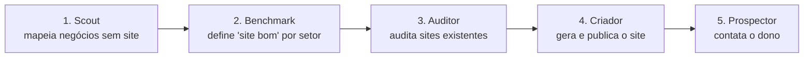
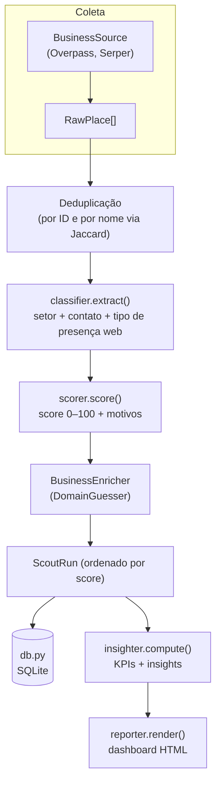
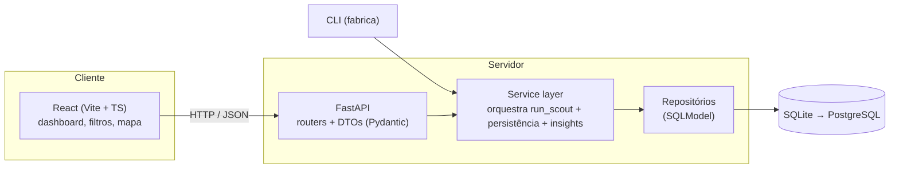

# Arquitetura

Esta seção explica **como o sistema é organizado** e **por quê**. Começamos pela visão de
alto nível (os 5 agentes em esteira), descemos para a arquitetura interna atual do Scout
e terminamos na **arquitetura-alvo full-stack** para onde estamos evoluindo.

!!! tip "Páginas desta seção"
    - **Visão geral** (esta página) — camadas, pipeline e arquitetura-alvo.
    - **Design Patterns** — os padrões usados no backend e no frontend.
    - **Design de Banco** — modelagem, índices e migrations.

## Visão de alto nível — 5 agentes em esteira

Cada agente entrega um artefato consumido pelo próximo. O fio condutor é o **banco**: o
Scout grava negócios; os demais agentes leem e enriquecem esses registros.

| # | Agente | Entrada | Saída | Stack prevista |
|---|--------|---------|-------|----------------|
| 1 | **Scout** | nome da cidade | negócios + score + relatório | httpx + OSM/Serper (sem LLM) |
| 2 | **Benchmark** | setor | diretrizes de "site bom" | LLM + busca web |
| 3 | **Auditor** | sites existentes | nota de qualidade + gaps | Playwright + LLM |
| 4 | **Criador** | negócio + diretrizes | site publicado (URL) | LangGraph + Claude + Next.js |
| 5 | **Prospector** | negócio + site demo | contato enviado | OpenClaw (WhatsApp) |

## Princípios de design

1. **Determinístico primeiro, IA depois.** Tudo que dá para resolver com regras
   (classificar setor, pontuar oportunidade) é feito sem LLM: grátis, rápido, testável e
   previsível. O LLM entra só onde agrega de verdade.
2. **Tudo plugável.** Trocar a fonte de dados ou o LLM não pode exigir reescrever o pipeline.
3. **Separação de responsabilidades.** Cada módulo tem uma única razão para mudar.
4. **Começar grátis e evoluir por fases.**

## Arquitetura interna atual do Scout (Fase 1)

O Scout é um **pipeline de dados** em estágios. A função orquestradora
[`run_scout()`](https://github.com/hectorautomacoesdev/fabrica-de-sites/blob/main/src/fabrica_sites/agents/scout/scout.py)
é **pura**: não sabe de HTTP, de HTML nem de banco. Recebe fontes e enrichers, devolve um
`ScoutRun`.

### Responsabilidade de cada módulo

| Módulo | Responsabilidade única | Não faz |
|--------|------------------------|---------|
| `models.py` | Define a forma dos dados (Pydantic) | Não valida regra de negócio |
| `config.py` | Lê configurações do ambiente | Não tem lógica |
| `core/sectors.py` | Taxonomia de setores + regras tag→setor | Não pontua |
| `sources/` | **De onde** vêm os negócios (plugável) | Não classifica |
| `classifier.py` | Extrai campos + detecta presença web | Não calcula score |
| `scorer.py` | Calcula o score de oportunidade | Não extrai campos |
| `enrichers/` | Melhora negócios já achados (plugável) | Não descobre negócios novos |
| `scout.py` | Orquestra o pipeline | Não sabe de HTTP/HTML/DB |
| `insighter.py` | Agrega KPIs e gera insights | Não gera HTML |
| `reporter.py` | Renderiza o HTML | Não calcula nada |
| `db.py` | Persiste no SQLite | Não tem regra de negócio |
| `cli.py` | Interface no terminal | Não tem regra de negócio |

### O ponto de extensão mais importante: `BusinessSource`

O Scout **não sabe** de onde vêm os negócios — só pede a uma `BusinessSource` que os
entregue como `RawPlace`. Adicionar uma fonte nova (Serper, Google Places, um CSV) é
implementar a mesma interface, **sem tocar** em classifier, scorer, insighter ou reporter.
O mesmo vale para `BusinessEnricher` (pós-processamento). Detalhe em
[Design Patterns](design-patterns.md) (Strategy / Plugin Pattern).

## Arquitetura-alvo: aplicação full-stack

Para virar a base sólida dos próximos agentes, o Scout evolui de "script + HTML estático"
para uma aplicação real, em **camadas**:

### O que cada camada faz (e por que separar)

- **Frontend (React)** — só apresentação e interação. Busca dados da API e os exibe. Não
  contém regra de negócio. Pode ser trocado sem afetar o servidor.
- **API (FastAPI)** — traduz HTTP ⇄ chamadas de serviço. Define os **DTOs** (contratos de
  entrada/saída) e cuida de validação, status e documentação automática (Swagger).
- **Service layer** — onde mora a orquestração reutilizável: dispara o `run_scout()`,
  persiste e calcula insights. É consumido **tanto pela API quanto pela CLI** — uma única
  fonte de verdade para a lógica, sem duplicação.
- **Repositórios (SQLModel)** — isolam o acesso ao banco. O service não escreve SQL; pede
  ao repositório. Trocar SQLite por Postgres não afeta as camadas de cima.
- **Banco** — SQLite local agora; Postgres depois (mesmo código SQLModel).

!!! info "A 'regra de dependência'"
    As setas apontam **para dentro**: o frontend depende da API, a API depende do serviço,
    o serviço depende do repositório. As camadas internas (regra de negócio) **não** conhecem
    as externas (HTTP, framework web, banco específico). É a ideia central da *Clean
    Architecture* — o que torna o núcleo testável e estável enquanto as bordas mudam.

### Por que a CLI e a API compartilham o service layer

Se a API reimplementasse a lógica de orquestração, teríamos duas versões para manter (e
divergir). Colocando tudo no service layer, a CLI vira um cliente fino (terminal) e a API
vira outro cliente fino (HTTP) — ambos chamando o mesmo código já testado.

## Referências

- Robert C. Martin — [The Clean Architecture](https://blog.cleancoder.com/uncle-bob/2012/08/13/the-clean-architecture.html)
- Alistair Cockburn — [Hexagonal Architecture (Ports & Adapters)](https://alistair.cockburn.us/hexagonal-architecture/)
- Martin Fowler — [Patterns of Enterprise Application Architecture](https://martinfowler.com/eaaCatalog/) (Service Layer, Repository)
- FastAPI — [Bigger Applications / estrutura em camadas](https://fastapi.tiangolo.com/tutorial/bigger-applications/)
- [The Twelve-Factor App](https://12factor.net/) — princípios para apps prontos para escalar
