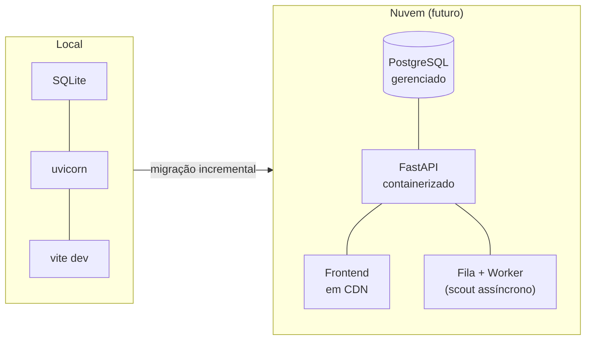

# Escalando para a Nuvem (futuro)

!!! note "Status"
    Esta página é **planejamento documentado**, não implementação. Hoje tudo roda **local**.
    O objetivo é mostrar que as escolhas atuais já preparam o terreno para escalar quando
    fizer sentido — sem reescrever o sistema.

## Estado atual (local)

| Camada | Hoje |
|---|---|
| Banco | SQLite (arquivo em `data/`) |
| Backend | `uvicorn` local (FastAPI) |
| Frontend | `vite dev` / build estático |
| Documentação | GitHub Pages (já na nuvem ✅) |
| Segredos | `.env` local |

## Princípios que já seguimos (Twelve-Factor App)

O [The Twelve-Factor App](https://12factor.net/) é o conjunto de práticas de fato para apps
que escalam. Já aplicamos vários:

- **Config no ambiente** (Fator III) — chaves em variáveis de ambiente / `.env`, nunca no código.
- **Backing services como recursos plugáveis** (Fator IV) — o banco é acessado por uma
  camada (repositório); trocar SQLite por Postgres é mudar a *connection string*.
- **Build, release, run separados** (Fator V) — o CI já faz build isolado da doc.
- **Logs como fluxo de eventos** (Fator XI) — a evoluir com logs estruturados.

## Caminho de escala (quando necessário)

### 1. Banco: SQLite → PostgreSQL gerenciado
Como o **SQLModel** abstrai o dialeto, migrar é de baixo risco: apontar para um Postgres
gerenciado (Neon, Supabase, RDS) e rodar as *migrations* do Alembic. Ganha concorrência
real e `JSONB` indexável.

### 2. Backend: containerizar e publicar
Empacotar o FastAPI em um **Docker** e publicar em uma plataforma de apps (Fly.io, Render,
Railway, Cloud Run). Stateless por design → escala horizontal (mais réplicas) sem sessão presa.

### 3. Frontend: build estático em CDN
O `vite build` gera arquivos estáticos → servir por CDN (Cloudflare Pages, Vercel, Netlify).
Rápido, barato e global. A SPA conversa com a API por HTTPS.

### 4. Tarefas longas: fila + worker
Um scout completo pode levar dezenas de segundos (rede). Em produção, em vez de uma
requisição HTTP síncrona, o ideal é **enfileirar** o job (RQ, Arq ou Celery) e o frontend
acompanhar o progresso — evita timeouts e melhora a experiência.

### 5. Cache
Cache dos **domínios já verificados** pelo DomainGuesser (com TTL) e das consultas mais
pesadas — economiza tempo e chamadas externas em reexecuções.

### 6. Observabilidade e segredos
- **Logs estruturados** (JSON) + métricas básicas (tempo por etapa, taxa de erro).
- **Gerenciador de segredos** da plataforma (não `.env`) em produção.

## Resumo: agora vs. nuvem

| Aspecto | Local (agora) | Nuvem (futuro) |
|---|---|---|
| Banco | SQLite | PostgreSQL gerenciado |
| Execução do scout | Síncrona | Fila + worker assíncrono |
| Backend | 1 processo local | Container, múltiplas réplicas |
| Frontend | dev server | CDN global |
| Custo | Zero | Sob demanda, quando houver valor |

> Coerente com o princípio do projeto: **começar grátis**, pagar só quando o valor estiver
> comprovado e o gargalo for claro.

## Referências

- [The Twelve-Factor App](https://12factor.net/)
- [Docker — Get Started](https://docs.docker.com/get-started/)
- [FastAPI — Deployment](https://fastapi.tiangolo.com/deployment/)
- [Vite — Building for Production](https://vite.dev/guide/build.html)
- Plataformas: [Fly.io](https://fly.io/docs/) · [Render](https://render.com/docs) ·
  [Neon](https://neon.tech/docs) · [Supabase](https://supabase.com/docs)
