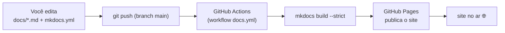

# Publicação, GitHub e CI/CD

Esta página explica **como o projeto vive no GitHub** e **como esta documentação se publica
sozinha** a cada alteração — o que foi configurado, para que serve e como usar no dia a dia.

!!! abstract "Resumo em uma frase"
    Você edita um arquivo Markdown em `docs/` e dá `git push`; o **GitHub Actions** republica
    o site MkDocs **e** builda o app React (que lê o mesmo `docs/`), automaticamente. Sem
    deploy manual.

!!! info "Fonte única"
    O conteúdo Markdown é **uma fonte só** (`docs/`), lida pelo MkDocs e pelo app React.
    Entenda o desenho em [Documentação de fonte única](fonte-unica.md).

## Onde tudo vive

| Item | Onde |
|---|---|
| Código + documentação (fonte) | Repositório **público** [hectorautomacoesdev/fabrica-de-sites](https://github.com/hectorautomacoesdev/fabrica-de-sites) |
| Documentação publicada | **GitHub Pages** → <https://hectorautomacoesdev.github.io/fabrica-de-sites/> |
| Segredos (chaves de API) | Apenas no `.env` **local** (nunca no repositório) |



## Configuração do GitHub

### Repositório
- **Visibilidade:** público (por enquanto). Quando começarmos a oferecer/vender sites a
  clientes, o repositório passará a **privado** — e a doc pode migrar para um host que aceita
  repositório privado (Cloudflare/Netlify Pages).
- **Licença:** proprietária — código visível, mas não licenciado para reuso.

### Segredos — o que NUNCA vai para o repositório
Esta é a regra de ouro de um repo público:

- A chave do **Serper** (e qualquer outra chave de API) vive **só** no arquivo `.env`,
  **local**, que está listado no `.gitignore` — portanto **nunca** é enviado.
- O que vai para o repositório é o **`.env.example`**: um modelo com os nomes das variáveis
  e **valores em branco**, para outra pessoa saber o que preencher.
- Dados de execução sensíveis (banco `fabrica.db`, dashboards gerados) ficam em `data/`, que
  também é ignorado pelo git.

```bash title=".gitignore (trecho relevante)"
.env                # segredos — NUNCA versionar
.venv/
data/*              # banco + relatórios gerados (exceto data/.gitkeep)
node_modules/
site/               # build local do MkDocs
```

!!! danger "Antes de cada publicação"
    Fazemos uma **varredura de segredos**: confirmar que a chave não aparece em nenhum
    arquivo rastreado (`git ls-files`). Num repo público, um segredo commitado deve ser
    considerado **vazado** — mesmo que removido depois, fica no histórico e em caches.

### `.gitattributes`
Normaliza as quebras de linha como **LF** no repositório, evitando ruído de CRLF↔LF entre
o Windows (desenvolvimento local) e o Linux (runners do CI).

## CI/CD com GitHub Actions

**CI/CD** = *Continuous Integration / Continuous Deployment*: automações que rodam a cada
mudança no código. No nosso caso, o "CD" publica a documentação automaticamente.

O workflow vive em [`.github/workflows/docs.yml`](https://github.com/hectorautomacoesdev/fabrica-de-sites/blob/main/.github/workflows/docs.yml).
Anatomia:

```yaml title=".github/workflows/docs.yml (anotado)"
on:
  push:
    branches: [main]          # roda a cada push na main...
    paths:                    # ...mas só se algo de doc/código mudou
      - "docs/**"
      - "docs-app/**"         # o app React lê docs/ — mudou um ou outro, valida os dois
      - "mkdocs.yml"
      - "src/**"
      - ".github/workflows/docs.yml"
      - "pyproject.toml"
  workflow_dispatch: {}       # permite rodar manualmente pelo botão do GitHub

permissions:                  # permissões mínimas para publicar no Pages
  contents: read
  pages: write
  id-token: write

concurrency:
  group: pages                # um deploy por vez (não cancela um em andamento)
  cancel-in-progress: false

jobs:
  build:                      # 1) constrói o site
    runs-on: ubuntu-latest
    steps:
      - uses: actions/checkout@v4
      - uses: actions/setup-python@v5
        with: { python-version: "3.12", cache: pip }
      - run: pip install -e ".[docs]"      # instala MkDocs + plugins (extra 'docs')
      - run: mkdocs build --strict         # FALHA em qualquer aviso (ex.: link quebrado)
      - uses: actions/upload-pages-artifact@v3
        with: { path: site }

  react-docs:                 # 1b) valida que o app React compila lendo a fonte única docs/
    runs-on: ubuntu-latest    #     (não publica — é só uma checagem; ver Fonte única)
    steps:
      - uses: actions/checkout@v4
      - uses: actions/setup-node@v4
        with: { node-version: "20", cache: npm, cache-dependency-path: docs-app/package-lock.json }
      - run: npm ci
        working-directory: docs-app
      - run: npm run build       # builda lendo ../docs — quebra se a fonte sair do lugar
        working-directory: docs-app

  deploy:                     # 2) publica o site MkDocs construído
    needs: build
    runs-on: ubuntu-latest
    environment: { name: github-pages, url: "${{ steps.deployment.outputs.page_url }}" }
    steps:
      - id: deployment
        uses: actions/deploy-pages@v4
```

**Por que `--strict`?** Faz o build **falhar** se houver link interno quebrado, âncora
inexistente ou página fora do nav. Assim, um erro na doc barra o deploy em vez de publicar
algo quebrado — é a nossa rede de segurança.

!!! note "Aviso de 'Node.js 20' no log"
    O GitHub mostra um aviso transitório de que as actions estão sendo forçadas a rodar em
    Node 24. É um comunicado da plataforma, **não um erro** — o deploy conclui normalmente.

## GitHub Pages

A Pages foi habilitada com **origem = GitHub Actions** (não a partir de um branch). Isso foi
feito uma única vez, via API:

```bash
gh api --method POST repos/hectorautomacoesdev/fabrica-de-sites/pages \
  -f "build_type=workflow"
```

A partir daí, o job `deploy` do workflow publica o artefato a cada execução. O site fica em
<https://hectorautomacoesdev.github.io/fabrica-de-sites/> com **HTTPS** obrigatório.

## Fluxo de atualização da documentação (o processo)

Como adicionar ou editar uma página, do começo ao ar:

1. **Editar/criar** o Markdown em `docs/` e, se for página nova, registrá-la no `nav` do
   `mkdocs.yml`.
2. **Pré-visualizar localmente** com recarregamento automático:
   ```powershell
   .\.venv\Scripts\python.exe -m mkdocs serve
   # abre em http://127.0.0.1:8000 e atualiza ao salvar
   ```
3. **Validar** como o CI vai validar (falha em link quebrado/aviso):
   ```powershell
   .\.venv\Scripts\python.exe -m mkdocs build --strict
   ```
4. **Publicar**: `git push` na `main` → o GitHub Actions builda e publica em ~30–40 s.

!!! tip "Convenção do projeto"
    Todo **plano** e **relatório de sessão** relevante vira página desta documentação — ela
    é a base de conhecimento viva e versionada do projeto.

### Como editar uma página direto pelo GitHub
Cada página tem um ícone de **lápis** (canto superior) que abre o arquivo no editor do
GitHub — graças ao `edit_uri: edit/main/docs/` no `mkdocs.yml`. Ao salvar (commit), o deploy
dispara sozinho.

## Referências

- [GitHub Actions — documentação](https://docs.github.com/actions)
- [GitHub Pages — publicando com Actions](https://docs.github.com/pages/getting-started-with-github-pages/configuring-a-publishing-source-for-your-github-pages-site#publishing-with-a-custom-github-actions-workflow)
- [`actions/deploy-pages`](https://github.com/actions/deploy-pages) ·
  [`actions/upload-pages-artifact`](https://github.com/actions/upload-pages-artifact)
- [Material for MkDocs — Publishing](https://squidfunk.github.io/mkdocs-material/publishing-your-site/)
