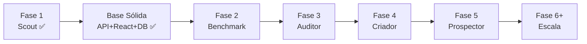

# Roadmap

Construção por fases, do simples ao complexo. Cada fase entrega algo que funciona sozinho
e gera valor.

## ✅ Fase 1 — Agente Scout

Mapear negócios da cidade, detectar quem não tem site, ranquear oportunidade.

- [x] Estrutura do projeto (src layout, venv, pyproject, CLI)
- [x] Fonte de dados grátis (OpenStreetMap/Overpass), plugável
- [x] Taxonomia de setores + classificação por tags
- [x] Detecção de presença web (sem site / só rede social / site próprio)
- [x] Score de oportunidade explicável (0–100)
- [x] **Enriquecimento de contatos** (Serper.dev) como segunda `BusinessSource`
- [x] **DomainGuesser** — descobre sites próprios não cadastrados no OSM
- [x] Persistência em SQLite
- [x] Dashboard HTML (KPIs, gráficos, mapa, tabela filtrável)
- [x] CLI com `run`, `setores`, `stats`
- [x] **77 testes** automatizados (unit, integração, desempenho)
- [x] Execução real validada: **513 negócios** em Guarujá, **145 leads quentes**

## ✅ Fase 1.5 — Base Sólida (concluída — jun/2026)

Transformar o Scout em aplicação real e criar a base de conhecimento. Detalhe completo no
[Plano — Base Sólida](plano-base-solida.md).

- [x] Repositório público no GitHub + higiene de segredos
- [x] Documentação MkDocs Material publicada no GitHub Pages (auto-deploy via Actions)
- [x] Backend FastAPI (7 endpoints REST) + service layer compartilhado com a CLI
- [x] Banco com SQLModel + Alembic (migration inicial + stamp para DBs existentes)
- [x] Frontend Vite + React + TypeScript (KPIs, tabela filtrável, modal de nova coleta)
- [x] Testes de API (16 testes de contrato — total: **93 testes**)
- [ ] Testes de componente React (Vitest + RTL) — próxima iteração
- [ ] E2E (Playwright) — próxima iteração
- [ ] CI para testes (`tests.yml`) — próxima iteração

## Fase 2 — Agente Benchmark

Para o setor escolhido, definir o que é um "site bom": funcionalidades esperadas,
referências, checklist pontuável. (LLM + busca web.)

## Fase 3 — Agente Auditor

Visitar os sites dos negócios que **têm** site, tirar screenshot, rodar checagem técnica,
comparar com as diretrizes do Benchmark e gerar nota + lista de gaps. (Playwright + LLM.)

## Fase 4 — Agente Criador

O mais complexo. Sub-agentes: coletor de info → planejador → gerador de código (Next.js)
→ QA → deploy (Vercel). (LangGraph + Claude.)

## Fase 5 — Agente Prospector

Gerar abordagem personalizada (nome, problema detectado, link do site demo) e enviar via
WhatsApp/e-mail. (OpenClaw — WhatsApp nativo e grátis.)

## Fase 6+ — Escala e automação

Centenas de negócios por rodada, sites Tier 2/3 (agendamento, cardápio, e-commerce),
deploy na nuvem e auto-monitoramento da taxa de aceite. Ver [Escalando para a nuvem](escala-nuvem.md).

## Orquestração multiagente (fases 2+)

No Python 3.14 atual, o CrewAI só resolve uma versão antiga. Para as fases 2+, a
recomendação é um **venv separado em Python 3.12** para as partes com framework
(CrewAI/LangGraph), mantendo o Scout leve. Ver [Decisões](decisoes.md) (D3).
