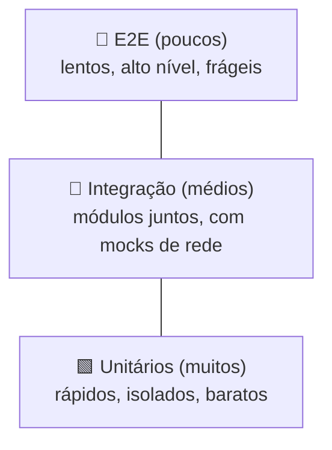

# Estratégia de Testes

Testes existem para uma coisa: **confiança para mudar o código sem medo**. Um sistema bem
testado pode ser refatorado, otimizado e estendido — porque uma regressão acende uma luz
vermelha na hora. Esta página explica os **tipos de teste**, **quais adotamos** e **por quê**.

!!! quote "Filosofia do projeto"
    Testes devem ser **rápidos**, **confiáveis** e **independentes do ambiente externo**.
    Os 77 testes atuais rodam em **~0,7 s** sem fazer nenhuma chamada de rede real.

## A pirâmide de testes

A heurística clássica (Mike Cohn, popularizada por Martin Fowler): **muitos** testes
unitários na base (rápidos, baratos), **menos** de integração no meio, **poucos** de ponta
a ponta (e2e) no topo (lentos, caros, frágeis).



!!! warning "Anti-padrão: o 'cone de sorvete'"
    Inverter a pirâmide — muitos e2e, poucos unitários — gera uma suíte **lenta e instável**.
    Preferimos empurrar a verificação para o nível mais baixo que ainda dê confiança.

## Tipos de teste e como usamos

### 1. Unitários — funções puras (a base)

Testam **uma** função isolada, sem dependências externas. É onde mora a maior parte da
nossa suíte: `scorer`, `classifier`, `sectors`, e os helpers do `domain_guesser`.

```python title="exemplo — parametrização (tests/test_domain_guesser.py)"
@pytest.mark.parametrize("nome, esperado", [
    ("Pousada", False),                # categoria genérica → não tenta
    ("Hotel Ilhas da Grécia", True),   # nome específico → tenta
    ("McDonald's", True),
])
def test_nome_vale_tentar(nome, esperado):
    assert _nome_vale_tentar(nome) == esperado
```

`@pytest.mark.parametrize` gera um teste por caso, cada um com nome próprio no relatório.

### 2. Integração — módulos juntos, sem rede real

Exercitam o pipeline `run_scout` de ponta a ponta, mas **substituindo a rede por mocks**
com `monkeypatch`. Garante que as peças encaixam, sem flakiness por depender de um serviço.

```python title="exemplo — mock de rede"
def test_checar_dominio_verdadeiro_para_status_200(monkeypatch):
    class _FakeResp: status_code = 200
    monkeypatch.setattr(
        "fabrica_sites.agents.scout.enrichers.domain_guesser.httpx.head",
        lambda *a, **kw: _FakeResp(),
    )
    assert _checar_dominio("qualquer.com.br", timeout=1.0) is True
```

### 3. Contrato / API — `TestClient` do FastAPI *(reestruturação)*

Sobem a aplicação em memória e validam **status HTTP, schema de resposta e filtros** de cada
endpoint — sem servidor real nem rede.

```python title="alvo — esboço"
def test_get_run_retorna_kpis(client):
    r = client.get("/api/runs/1")
    assert r.status_code == 200
    assert {"total", "leads_quentes"} <= r.json().keys()
```

### 4. Componente (frontend) — Vitest + React Testing Library *(reestruturação)*

Renderizam um componente isolado e simulam interações do usuário. A *Testing Library*
incentiva testar **comportamento** (o que o usuário vê/faz), não detalhes de implementação.

```tsx title="alvo — esboço"
test("filtra por setor ao selecionar", async () => {
  render(<TabelaNegocios dados={fixture} />);
  await userEvent.selectOptions(screen.getByLabelText("Setor"), "alimentacao");
  expect(screen.getAllByRole("row")).toHaveLength(/* só de alimentação */);
});
```

### 5. End-to-end (e2e) — Playwright *(reestruturação)*

Abrem um navegador real, carregam o app, rodam um fluxo completo (rodar scout → filtrar →
ver resultados) e conferem o que aparece na tela. Poucos, focados nos caminhos críticos.

### 6. Desempenho — tracemalloc + perf_counter

Já existem em `tests/test_performance.py`. Estabelecem **limites aceitáveis** de tempo e
memória; se uma mudança ultrapassa o limite, o teste falha e a regressão é detectada.

```python title="tests/test_performance.py (trecho)"
def test_pipeline_500_negocios_abaixo_de_500ms():
    run = run_scout("Teste", source=_SyntheticSource(_raw_sem_site(500)))
    assert run.total == 500
    assert _medir.ultimo_tempo < 0.5     # baseline medido: ~0,04 ms/negócio
```

### Mencionados como opção (ainda não adotados)

- **Property-based** ([Hypothesis](https://hypothesis.readthedocs.io/)) — gera entradas
  aleatórias e procura contraexemplos. Útil para o normalizador de nomes/slug.
- **Snapshot** — congela uma saída (ex.: HTML/JSON) e alerta quando muda.

## Princípios que seguimos

| Princípio | Como aplicamos |
|---|---|
| **Rápido** | 77 testes em ~0,7 s; dados sintéticos no lugar de rede |
| **Determinístico** | `monkeypatch` em tudo que toca rede → zero flakiness |
| **Legível** | nomes descritivos (`test_so_rede_social_eh_lead_mais_quente...`) |
| **DRY nos casos** | `@pytest.mark.parametrize` em vez de copiar/colar |
| **Mede, não chuta** | limites de desempenho explícitos com `tracemalloc` |

## O que escolhemos e por quê

- **pytest** como framework único do backend: fixtures, parametrização e `monkeypatch`
  cobrem tudo que precisamos com pouco boilerplate (mais simples que `unittest`).
- **Vitest + RTL** no frontend: o Vitest compartilha config com o Vite (zero setup extra) e
  a RTL alinha os testes ao comportamento do usuário.
- **Playwright** para e2e: rápido, multi-navegador, com espera automática (menos testes
  intermitentes que alternativas mais antigas).
- A **proporção da pirâmide**: priorizamos unitários (baratos) e usamos e2e com parcimônia
  (caros) — máxima confiança pelo menor custo de manutenção.

## Integração contínua (CI)

O workflow de testes roda **pytest** (backend) e **Vitest** (frontend) a cada push, barrando
regressões antes do merge. O deploy da documentação usa `mkdocs build --strict`, que falha
em qualquer aviso (inclusive link quebrado).

## Referências

- Martin Fowler — [Test Pyramid](https://martinfowler.com/bliki/TestPyramid.html) ·
  [Testing Strategies in a Microservice Architecture](https://martinfowler.com/articles/microservice-testing/)
- [pytest — documentação](https://docs.pytest.org/) ·
  [parametrize](https://docs.pytest.org/en/stable/how-to/parametrize.html) ·
  [monkeypatch](https://docs.pytest.org/en/stable/how-to/monkeypatch.html)
- [Testing Library — Guiding Principles](https://testing-library.com/docs/guiding-principles/)
- [Vitest](https://vitest.dev/) · [Playwright](https://playwright.dev/)
- [tracemalloc](https://docs.python.org/3/library/tracemalloc.html) ·
  [Hypothesis](https://hypothesis.readthedocs.io/)
